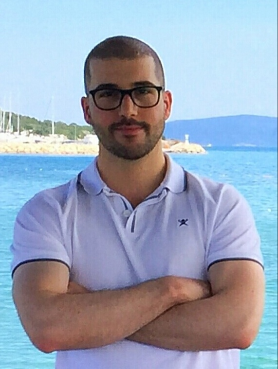

# About me

<figure><figcaption></figcaption></figure>

_Welcome to my personal page_!

I am a post-doc researcher at University of Minho (in the beautiful city of Guimarães, Portugal) and a passionate about applied mathematics and scientific computing.

The research I conduct conderns the development of novel numerical methods in <mark style="color:blue;">**finite volume and discontinuous Galerkin philosophy**</mark>, mainly with high-order of accuracy, focusing on the numerical and implementation challenges in high-performance computing platforms as well as their application in the fields of <mark style="color:blue;">**computational fluid dynamics and computational rheology.**</mark>
