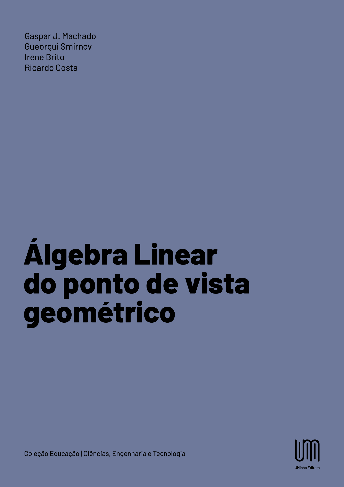
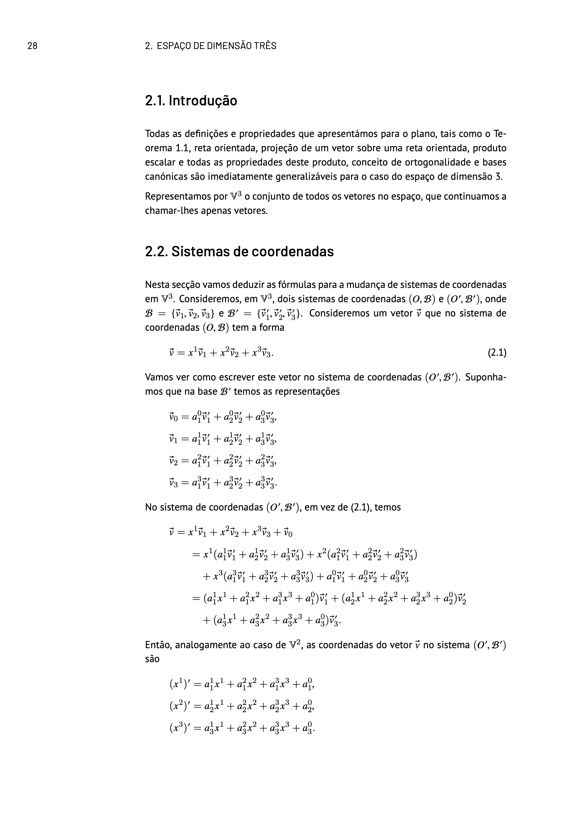
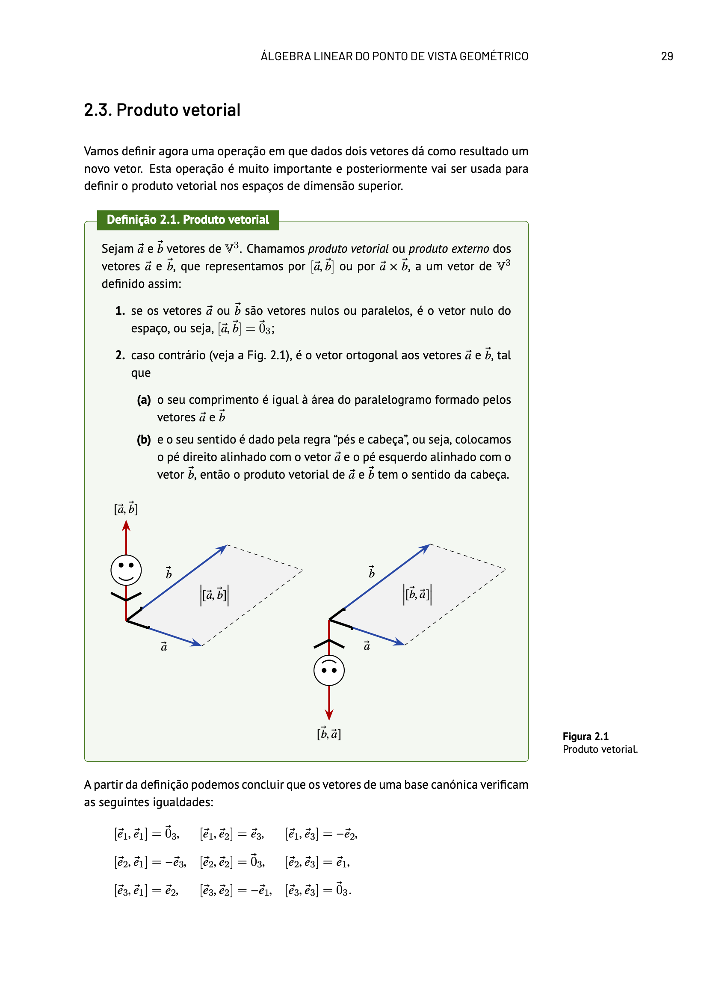

---

_Neste livro, escrito para os estudantes de cursos de Matemática Aplicada, Física e Engenharia, a ênfase é dada ao aspeto geométrico da Álgebra Linear. Embora a maior parte do seu conteúdo seja voltada para quem inicia o estudo desta disciplina, leitores de níveis mais avançados também encontrarão aqui ligações importantes entre a Álgebra Linear e outras áreas da Matemática._

DOI: [https://doi.org/10.21814/uminho.ed.174](https://doi.org/10.21814/uminho.ed.174).

  

    
  

  

    
  

  

    Front cover.
  

  

    Back cover.
  

Escrevemos este livro para estudantes de cursos de Matemática Aplicada, Física e Engenharia, que estudam Álgebra Linear no primeiro ano da Universidade, o que explica a escolha da matéria e o nível de generalidade da apresentação. Incluímos no livro apenas os conceitos e resultados importantes para as aplicações da Matemática e as demonstrações foram feitas sem tentar atingir a máxima generalidade. Do nosso ponto de vista, o nome "Álgebra Linear" não é o mais adequado para chamar a esta disciplina. O nome mais adequado seria "Geometria de Espaços de Dimensão Finita". No entanto, decidimos dar ao livro o título "Álgebra Linear do Ponto de Vista Geométrico" para não confundir o leitor sobre o seu conteúdo. Salientamos, porém, que é daquele ponto de vista que expomos a matéria neste livro.

O livro contém doze capítulos. No primeiro capítulo introduzimos os conceitos principais do cálculo vetorial no plano. Estes conceitos são generalizados para o espaço de dimensão três no segundo capítulo. O espaço linear de dimensão $n$ é o objeto principal de estudo no terceiro capítulo. No quarto capítulo estudamos espaços normados e Euclidianos. No capítulo cinco consideramos as aplicações lineares e estabelecemos a correspondência entre aplicações lineares e matrizes. Introduzimos a noção de determinante como um objeto geométrico no sexto capítulo. Os vetores e valores próprios são o tema do sétimo capítulo. No oitavo capítulo estudamos os espaços afins que generalizam os espaços de vetores considerados nos primeiros dois capítulos do livro. No nono capítulo consideramos formas quadráticas. Dedicamos o capítulo dez às cónicas e o capítulo onze às quádricas. O último capítulo é destinado ao leitor mais preparado. Nele demonstramos o Teorema Fundamental da Álgebra e o teorema sobre a forma canónica de Jordan.

As partes do livro dedicadas à ligação da Álgebra Linear com outros ramos da Matemática, tais como equações diferenciais ordinárias, cadeias de Márkov, análise funcional e equações em derivadas parciais, ou que têm matéria mais difícil, estão marcadas com um asterisco. O leitor interessado pode voltar a estas partes numa segunda leitura, pois este livro foi pensado como "livro de cabeceira" de um estudante durante todo o seu percurso académico.

O livro não tem exercícios. É aconselhável o uso do livro de exercícios _Seymour Lipschutz, Marc L. Lipson, Linear Algebra, Schaum's Outline Series, McGraw-Hill, 2009_ para aprender melhor a matéria.

Escrevemos este texto como uma introdução à Álgebra Linear. Ao leitor interessado em conhecer os resultados mais profundos desta parte da Matemática podemos recomendar os seguintes livros: _Felix R. Gantmacher, The Theory of Matrices, AMS Chelsea Publishing, 1959_; _Georgi E. Shilov, Linear Algebra, Dover Publications, 1977_; _Paul Halmos, Finite-Dimensional vetor Spaces, Springer, 1987_; _Luís Magalhães, Álgebra Linear como Introdução a Matemática Aplicada, Texto Editora, 1996_; _Igor R. Shafarevich and Alexey O. Remizov, Linear Algebra and Geometry, Springer, 2013_; _Sheldon Axler, Linear Algebra Done Right, Springer, 2015_.

  

    
  

  

    
  

  

    Sample page.
  

  

    Sample page.
  

