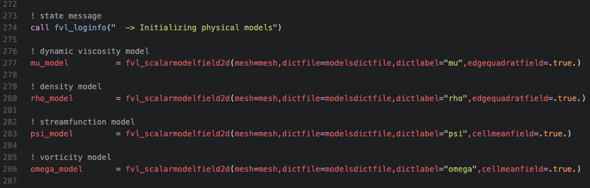
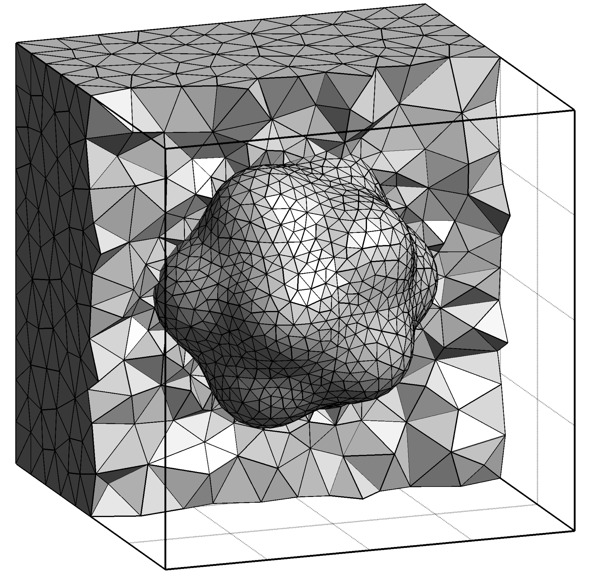

The FVLib code is a library of advanced computational algorithms and numerical methods to solve partial differential equations (PDEs) within the **finite volume philosophy**. The project aims to deliver **high-accurate**, **high-performance**, and **high-efficient** simulations of a wide range of physics and mechanics problems in relevant industrial, environmental, and biomedical applications.

### Main features

These are the main capabilities of the FVLib code:

---

#### **Modern object-oriented Fortran (2003/2008 standards)**

The FVLib code is programmed in modern Fortran (2003/2008 standards) with an object-oriented paradigm for better _code reuse, maintenance, and readability_. Its architecture is organised in three levels:

- **core level**: linear algebra algorithms, input/output, mesh and field handlers, etc.
- **apps level**: specific model solvers, pre-processing, and post-processing tools.
- **case level**: geometry files, mesh files, parameters files, and setup scripts.

---

#### **Very high-order accuracy in space and time**

The discretisation methods implemented in the FVLib code are highly accurate in space and time, effectively achieving up to the eighth-order of convergence. Comprehensive benchmarking proves that high-order accurate schemes benefit from a better trade-off between accuracy and efficiency than the counterpart lower-order accurate ones. Hence, this property can be exploited in different ways:

- **Improved accuracy**: for the same discrete geometrical representation level (number of degrees of freedom), high-order accurate schemes provide _significantly more accurate solutions_ than those obtained with the traditional first- and second-order accurate schemes.

- **Enhanced performance**: for the same approximate solution accuracy level, high-order accurate schemes provide _significantly more efficient computations_ (execution time) than those of the traditional first- and second-order accurate schemes.

- **Resource-use efficiency**: for the same approximate solution accuracy level, high-order accurate schemes consume _significantly less resources_ (power and memory) than those of the traditional first- and second-order accurate schemes.

  

    
  

  

    
  

---

#### **Unstructured meshes with general element shapes**

Complex geometries arise in many problems of physics and engineering applications, for which Cartesian grid embedded boundary domain approaches still lack the _flexibility and robustness of domain fitted unstructured mesh approaches_ , especially in 3D. The high-order accurate discretisation methods implemented in the FVLib code can handle 2D and 3D unstructured meshes with general element shapesfor the most demanding problems with intricate geometries.

  

    
  

  

    
  

---

#### **Arbitrary curved domains with piecewise linear meshes**

- for complex geometries in real applications

#### **Parallel computing for HPC environments**

The FVLib code  take advantage of modern HPC systems

Currently, the following problems can be solved in the FVLib code:

- Convection-diffusion problems for heat and species transfer
- Conjugate heat transfer with solid/solid and solid/fluid interfaces
- Incompressible isothermal fluid flows with the Euler/Stokes/Navier-Stokes formulation
- Incompressible non-isothermal fluid flows with the Euler/Stokes/Navier-Stokes formulation
- Incompressible non-Newtonian fluid flows with the Stokes/Navier-Stokes formulation

### Contributing

The FVLib code is not currently an open-source project. However, anyone willing to contribute to the project and/or making use of its potentialities on a collaboration basis is welcome. Please, [contact me](mailto:rcosta@dep.uminho.pt).
