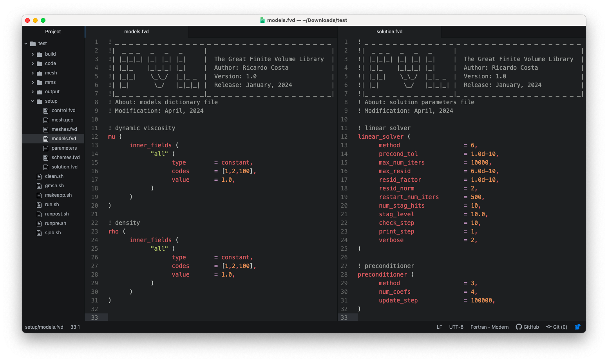
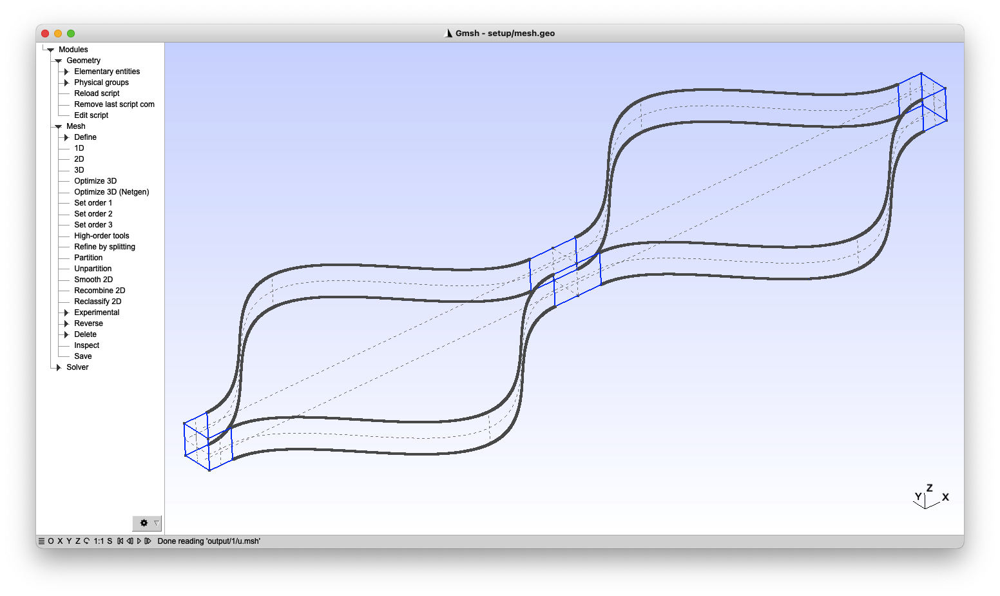
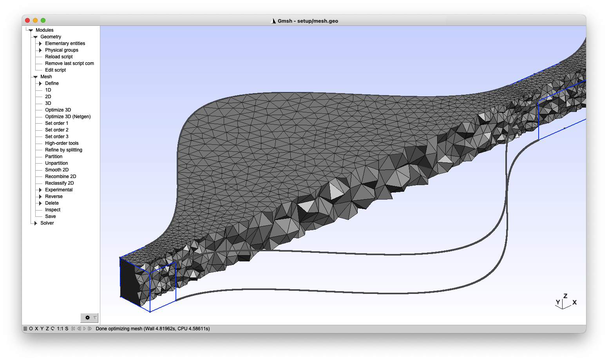

## The Great Finite Volume Library

The FVLib code is a library of advanced computational algorithms and numerical methods to solve partial differential equations (PDEs) within the **finite volume philosophy**. The project aims to deliver **high-accurate**, **high-performance**, and **high-efficient** simulations of a wide range of physics and mechanics problems in relevant industrial, environmental, and biomedical applications.

The FVLib code is the result of years of dedication and passion for applied mathematics and scientific computing, and the ambition of **pushing the limits of numerical simulation even further** in serving the scientific knowledge and technological innovation.

---

### **Modern object-oriented Fortran (2003/2008 standards)**

The FVLib code is programmed in modern Fortran (2003/2008 standards) with an object-oriented paradigm for better _code reuse, maintenance, and readability_. Its architecture is organised in three levels:

- **Core level**: including linear algebra algorithms, input/output interfaces, mesh and field handlers, sparse matrix structures, etc.

- **Applications level**: including specific model solvers, specific boundary and interface conditions, and pre-processing and post-processing tools.

- **Cases level**: including geometry files, mesh generation scripts, models and schemes parameters files, and running and post-processing scripts.

  

    
  

  

    
  

  

    Applications level.
  

  

    Cases setup.
  

---

### **Highly accurate schemes in space and time**

The discretisation methods implemented in the FVLib code are highly accurate in space and time, effectively achieving up to the eighth-order of convergence. Comprehensive benchmarking proves that high-order accurate schemes benefit from a _better trade-off between accuracy and efficiency_ than the counterpart lower-order accurate ones. This property can be exploited in different ways:

- **Improved accuracy**: for the same discrete geometrical representation level (number of degrees of freedom), high-order accurate schemes provide _significantly more accurate solutions_ than those obtained with the traditional first- and second-order accurate schemes.

- **Enhanced performance**: for the same approximate solution accuracy level, high-order accurate schemes provide _significantly more efficient computations_ (execution time) than those of the traditional first- and second-order accurate schemes.

- **Resource-use efficiency**: for the same approximate solution accuracy level, high-order accurate schemes consume _significantly less resources_ (power and memory) than those of the traditional first- and second-order accurate schemes.

  

    
  

  

    
  

  

    Error <em>versus</em> number of unknowns.
  

  

    Error <em>versus</em> execution time.
  

---

### **Unstructured meshes for complex geometries**

Complex geometries arise in many real-world problems of physics and engineering applications, for which domain fitted unstructured meshes are still the preferred approach for its _flexibility and robustness_, especially in 3D.

- **General element shapes**: the high-order accurate discretisation methods implemented in the FVLib code can handle _2D and 3D unstructured meshes with general element shapes_ for the most demanding problems in intricate geometries.

- **Linear piecewise meshes**: the high-order accurate discretisation methods implemented in the FVLib code preserve the optimal _high-orders of convergence with the standard linear piecewise elements_, on arbitrary curved geometries, overcoming the cumbersomeness of generating and dealing with curved meshes as the traditional approaches.

  

    
  

  

    
  

  

    Intricate curved geometry.
  

  

    Unstructured linear piecewise mesh.
  

- **Gmsh compatible interface**: the FVLib code provides a compatibility interface with [Gmsh](https://gmsh.info/), an open source _3D mesh generator with built-in pre- and post-processing facilities_, designed to provide a fast, light and user-friendly meshing tool with parametric input and flexible visualisation capabilities.

  

    
  

  

    
  

  

    Gmsh snapshot with geometry.
  

  

    Gmsh snapshot with mesh.
  

---

### **Parallel computing for HPC environments**

The FVLib code multi-processing capabilities are implemented based on the _shared-memory and message-passing parallel programming models_ through the OpenMP and OpenMPI application programming interfaces. It allows the development and deployment of portable and scalable large-scale parallel applications that take advantage of modern HPC systems.

---

### Contributing

The FVLib code is not currently an open-source project. However, anyone willing to contribute to the project and/or making use of its capabilities on a collaboration basis is welcome. If you are interested in using it or need further details, you can always [contact me](mailto:rcosta@dep.uminho.pt).
