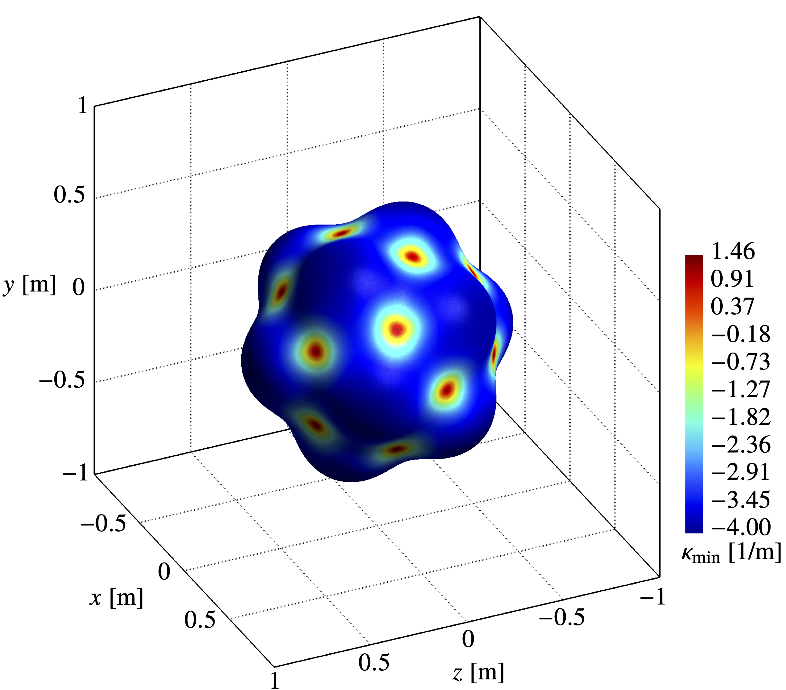

      Short description on the research topics I have been investigating. Please refer to the <i>Curriculum Vitae</i> for a complete list.

### Arbitrary curved boundaries

Treating complex geometries is critical in developing high-order accurate discretisation methods (above the second-order) for the numerical simulation of real engineering applications. However, most works published in that context only consider simple polygonal domains, substantially limiting their practical applicability. In particular, the treatment of curved domains requires sophisticated techniques to overcome the geometrical mismatch between the physical boundary (where the boundary conditions are prescribed) and the mesh boundary (where the equations are discretised).

In the finite element context, the **isoparametric elements method** has become the conventional approach for treating curved boundaries and recovering the optimal high-order of convergence. The technique employs **curved meshes** to geometrically fit the physical boundary, and similar techniques have been proposed for the finite volume (FVM) and discontinuous Galerkin (DGM) methods. Although effective, these techniques suffer from significant drawbacks, such as:

- **Sophisticated meshing algorithms** for generating meshes with curved elements.
- **Cumbersome quadrature rules** for integration on the curved elements.
- **Complex nonlinear transformations** for the mapping between curved and standard elements.

  

    
    Curved mesh.
  

  

    
    Polygonal mesh.
  

In [1,2] a novel approach is proposed, the **reconstruction for off-site data (ROD) method**, to recover the high-order of convergence for arbitrary curved boundaries while overcoming such limitations. The ROD method transfers the prescribed boundary conditions from the physical boundary to the mesh boundary through specific constrained polynomial reconstructions, while the problem unknowns are defined on the mesh and the discretisation is performed on polygonal elements solely. Therefore:

- **Conventional meshing algorithms** for generating meshes with polygonal elements.
- **Simple quadrature rules** for integration on the polygonal elements.
- **There are no transformations** for the mapping since curved elements are avoided.

The technique was developed in the FVM context for the 2D convection-diffusion problem with **general boundary conditions**, effectively achieving the sixth-order of convergence on unstructured meshes. The proposed approach has received significant attention from the scientific community for its **simplicity**, **efficiency**, and **generality** in handling any boundary condition, and the extension to the FDM and DGM has already been successfully accomplished [3,4,5].

---

### Conjugate heat transfer problems

Another essential challenge in the numerical simulation of real engineering applications is the development of accurate and robust discretisation methods for elliptic equations with discontinuous coefficients, where two adjacent domains with different properties share an interface, as in conjugate heat transfer problems. Specific interface conditions are prescribed on the interface, imposing a discontinuous temperature normal derivative due to thermal energy conservation. Thermal resistance from one domain into another can also exist, resulting in discontinuous solutions across the interface. For these reasons, treating multidomain problems with discontinuous coefficients requires a special interface treatment, particularly for achieving a high-order of convergence. In that concern, the candidate proposed in [6,7,8] a technique that applies a Dirichlet-Neumann or Neumann-Neumann decomposition on the interface to transform the conjugate problem into separated partitioned subproblems. Each subproblem can then be discretised as a conventional boundary-valued convection-diffusion problem, and the thermal coupling between subdomains is recovered through specific polynomial reconstructions on the interface. The method was developed in the FVM paradigm for the 2D and 3D conjugate heat transfer problem with general interface conditions and was equipped with the ROD method to handle arbitrary curved interfaces, effectively achieving the sixth-order of convergence on unstructured meshes.

  

    
    Continuity interface condition.
  

  

    
    Jump interface condition.
  

---

### Incompressible fluid flow problems

The numerical solution of the Navier-Stokes equations is fundamental in computational fluid dynamics. When the incompressibility constraint (div-grad duality) is considered, significant challenges arise for developing accurate, robust, and stable discretisations, particularly in the high-order accurate context. In that concern, the candidate proposed in [9,10] a very high-order accurate FVM based on specific polynomial reconstructions computed on a staggered mesh construction to handle the div-grad duality. The solution of the resulting velocity-pressure coupled system was also improved with a novel incomplete inverse preconditioning technique based on the Schur complement for the saddle-point matrix. The method was further improved and equipped with the ROD method [11] to solve 2D fluid flow problems in arbitrary curved boundaries, effectively achieving the sixth-order of convergence on unstructured meshes.

---

### General slip boundary conditions

The conventional no-slip (Dirichlet) boundary condition does not always hold in several fluid flow problems and must be replaced with appropriate slip conditions. These conditions are particularly challenging to impose, and their numerical treatment is a delicate issue far from being well-developed. Indeed, despite its importance from inviscid to viscoelastic fluid flow problems, the literature on the subject is limited, and the existing methods can only achieve the second-order of convergence. In that concern, the candidate proposed in [12] a simple and efficient numerical treatment in the FVM paradigm of general slip boundary conditions prescribed on arbitrary curved boundaries for 3D fluid flow problems governed by the incompressible Navier–Stokes equations. On curved boundaries, the slip boundary conditions are reformulated on a local reference system, allowing a direct application of the ROD method to achieve the eighth-order of convergence on unstructured meshes.

  

    
    Boundary maximum curvature.
  

  

    
    Boundary minimum curvature.
  

