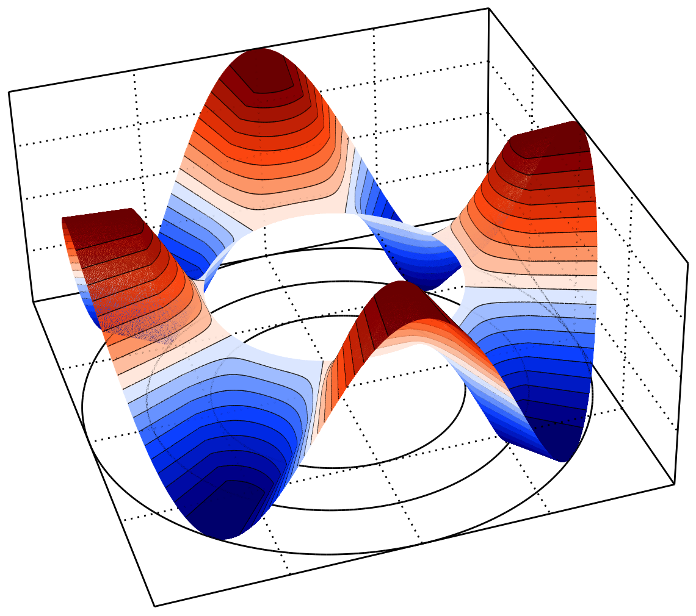
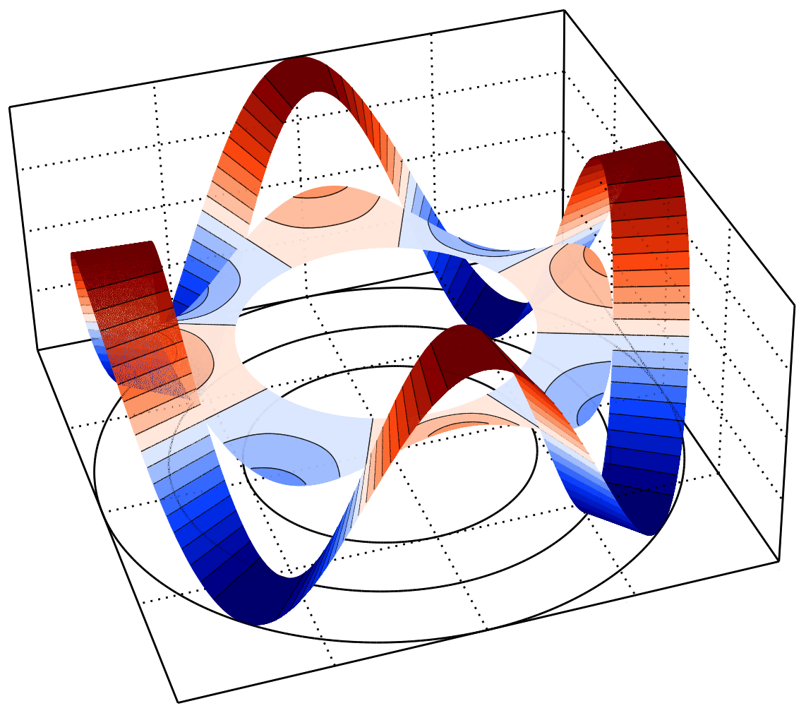
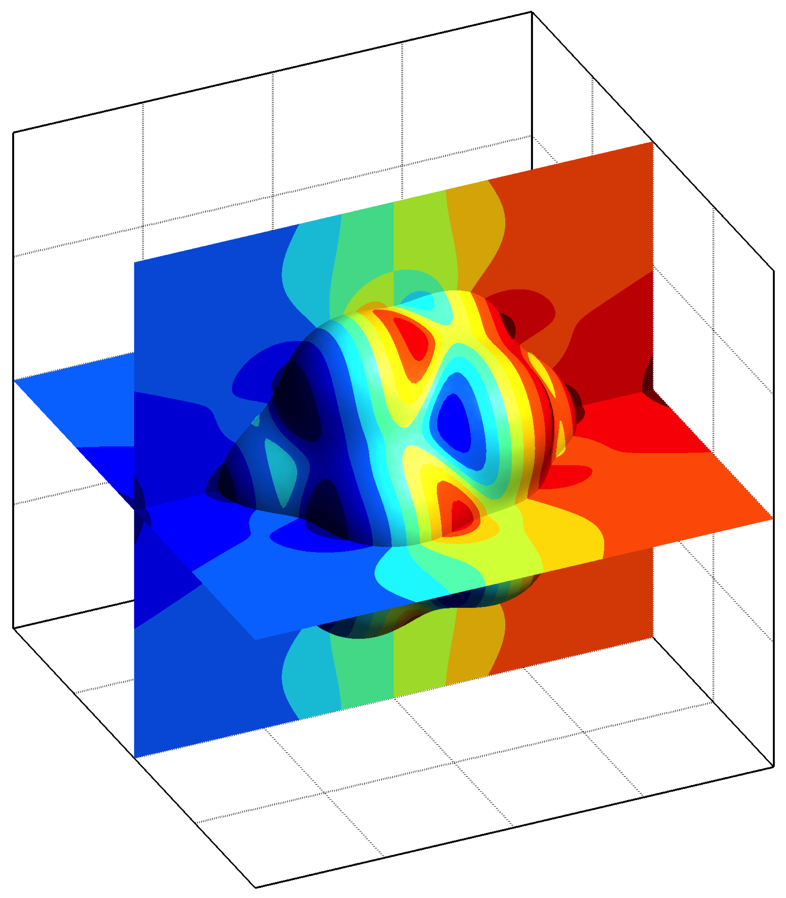
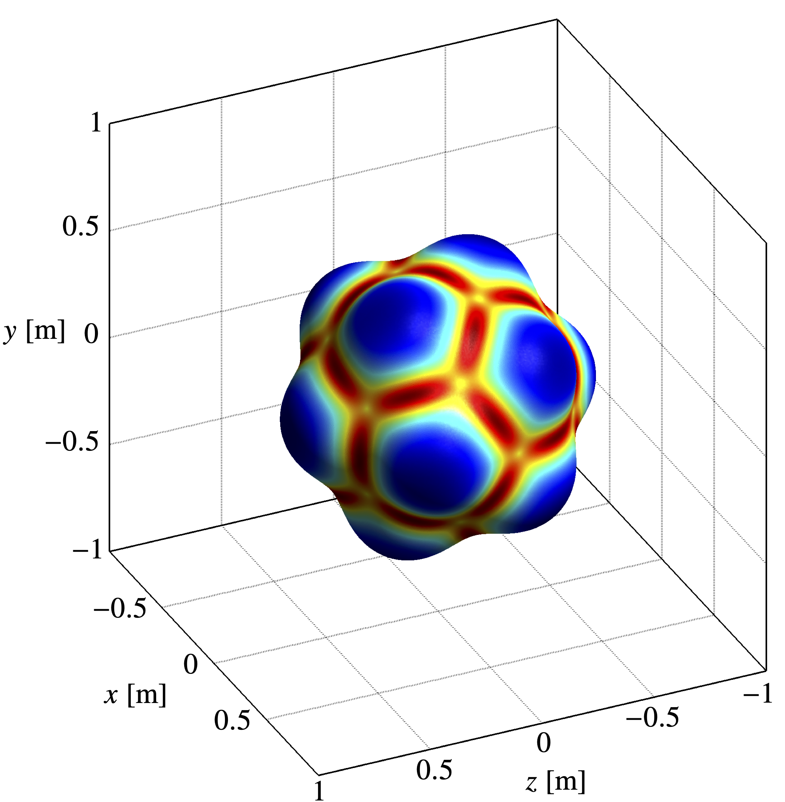

  Short description on the most relevant research topics I have investigated. Please refer to the <i>Curriculum Vitae</i> for a complete list.

---

### Arbitrary curved boundaries

Treating complex geometries is critical in developing high-order accurate discretisation methods (above the second-order) for the numerical simulation of real engineering applications. However, most works published in that context only consider simple polygonal domains, substantially limiting their practical applicability. In particular, the treatment of curved domains requires sophisticated techniques to overcome the geometrical mismatch between the physical boundary (where the boundary conditions are prescribed) and the mesh boundary (where the equations are discretised).

In the finite element paradigm, the **isoparametric elements method** has become the conventional approach for treating curved boundaries and recovering the optimal high-order of convergence. The technique employs **curved meshes** to geometrically fit the physical boundary, and similar techniques have been proposed for the finite volume (FVM) and discontinuous Galerkin (DGM) methods. Although effective, these techniques suffer from significant drawbacks, such as:

- **Sophisticated meshing algorithms** for generating meshes with curved elements.
- **Cumbersome quadrature rules** for integration on the curved elements.
- **Complex nonlinear transformations** for the mapping between curved and standard elements.

  

    
  

  

    
  

  

    Curved mesh.
  

  

    Polygonal mesh.
  

In [[here](https://doi.org/10.1016/j.apm.2017.10.016),[here](https://doi.org/10.1002/nme.5953)], a novel approach is proposed, the **reconstruction for off-site data (ROD) method**, to recover the high-order of convergence for arbitrary curved boundaries while overcoming such limitations. The ROD method transfers the prescribed boundary conditions from the physical boundary to the mesh boundary through specific constrained polynomial reconstructions, while the problem unknowns are defined on the mesh and the discretisation is performed on polygonal elements solely. Therefore:

- **Conventional meshing algorithms** for generating meshes with polygonal elements.
- **Simple quadrature rules** for integration on the polygonal elements.
- **There are no transformations** for the mapping since curved elements are avoided.

The technique was developed in the FVM paradigm for the 2D convection-diffusion problem with **general boundary conditions**, effectively achieving the sixth-order of convergence on unstructured meshes. The proposed approach has received significant attention from the scientific community for its **simplicity**, **efficiency**, and **generality** in handling any boundary condition, and the extension to the FDM and DGM has already been successfully accomplished [[here](https://doi.org/10.1016/j.cma.2019.112782),[here](https://doi.org/10.1016/j.jcp.2021.110217)].

---

### Conjugate heat transfer problems

Many real engineering applications concern **non-isothermal physical systems** that involve thermodynamic processes between solids and fluids, consisting of materials with different thermal properties that are **thermally coupled** through non-adiabatic contacts. The **conjugate heat transfer** (CHT) problem consists in determining the temperature distribution in these **multi-material domains** with specific thermodynamic laws applied for the heat transfer on the contacts.

Many multi-physics problems in fluid mechanics, solid mechanics, and electromagnetics involve multi-material domains and physical quantities that depend on the temperature, such as **thermomechanics**, **thermoelasticity**, **electrothermomagnetics**, and **fluid-thermal-structure interaction**. Thus, the development of accurate and robust discretisation methods for elliptic and parabolic equations with discontinuous coefficients is an essential challenge in the numerical simulation of real engineering applications.

In CHT, specific **interface conditions** are prescribed on the interface depending on the nature of the contact, usually imposing a discontinuous normal derivative of temperature due to the thermal energy conservation that needs to be satisfied. Additionally, if a **perfect contact without friction** is assumed, a continuous temperature across the interface is imposed (**continuity interface condition**), whereas real scenarios might require to assume **imperfect contacts with friction** resulting in an implicit temperature jump cross the interface (**jump interface condition**).

  

    
  

  

    
  

  

    Continuity interface condition.
  

  

    Jump interface condition.
  

Treating multi-domain problems with discontinuous coefficients requires a special interface treatment, particularly for achieving a high-order of convergence. In [[here](https://doi.org/10.1016/j.cma.2019.07.029),[here](https://doi.org/10.1016/j.jcp.2021.110604),[here](https://doi.org/10.1002/nme.6892)], a novel technique is proposed based on a **Dirichlet-Neumann** and **Neumann-Neumann decomposition** on the interface to transform the conjugate problem into separated partitioned subproblems. Each subproblem can then be discretised as a **conventional boundary-valued convection-diffusion problem**, and the thermal coupling between subdomains is recovered through specific constrained polynomial reconstructions on the interface. The method was developed in the FVM paradigm for the 2D and 3D conjugate heat transfer problem with general interface conditions and was equipped with the **ROD method** to handle **arbitrary curved interfaces**, effectively achieving the sixth-order of convergence on unstructured meshes.

---

### Incompressible fluid flow problems

The numerical solution of the **Navier-Stokes equations** is a fundamental problem in computational fluid dynamics, enabling the numerical simulation of uncountable real engineering applications. Besides the **momentum balance equation**, the system requires a **mass conservation equation** specified depending on the flow dynamics. For incompresible flows, the **incompressibility constraint** (div-grad duality) specifies that the mass rate of change equals zero in any control volume. Although conceptually simple, constraint raises significant challenges for developing accurate, robust, and stable discretisations, particularly in the high-order accurate context.

Several stabilisation techniques were developed in the context of first- and second-orders accurate methods, such as discretisation on **staggered meshes** or the classical Rhie-Chow interpolation on **collocated meshes** for the pressure-velocity coupling. These techniques cannot, however, be easily extended for achieving high-order of convergence. In [[here](https://doi.org/10.1007/s10915-016-0348-9),[here](https://doi.org/10.1016/j.jcp.2017.07.047)], a very high-order accurate method is proposed in the FVM paradigm based on specific polynomial reconstructions computed on a **staggered mesh** construction to handle the **div-grad duality**. The solution of the resulting velocity-pressure coupled system is also accelerated with a novel **incomplete inverse preconditioning technique** based on the **Schur complement** for saddle-point matrices. The work is further improved and equipped with the **ROD method** in [[here](https://doi.org/10.1016/j.cma.2022.115064),[here](https://doi.org/10.1016/j.cma.2023.116274)] to solve 2D and 3D incompressible fluid flow problems in **arbitrary curved boundaries**, effectively achieving the sixth-order of convergence on unstructured meshes.

  

    
  

  

    
  

  

    Pressure.
  

  

    Streamlines.
  

---

### General slip boundary conditions

The conventional **no-slip boundary condition** does not hold in several fluid flow problems and must be replaced with appropriate **slip boundary conditions** according to the wall and fluid properties. From **inviscid** to **viscoelastic fluid flows**, imposing appropriate slip boundary conditions is an essential problem in many real engineering applications. However, not only they are still a subject of discussion among fluid dynamicists, but also these conditions are particularly challenging to impose and their numerical treatment is a delicate issue far from being well-developed, particularly in the context of very high-order accurate methods.

The literature on general slip boundary conditions is limited, and the existing methods can only achieve the first- and second-orders of convergence. On the other hand, the complexity of these conditions significantly increases on **curved boundaries**, since the tangential component of the fluid traction vector on the boundary depends on the **boundary line curvature**. In 3D, these conditions become especially challenging since both principal **surface curvatures** are necessary.

  

    
  

  

    
  

 

  

    Boundary maximum curvature.
  

  

    Boundary minimum curvature.
  

In [[here](https://doi.org/10.1016/j.cma.2023.116274)], a simple, efficient, and very high-order accurate method is proposed in the FVM paradigm to impose **general slip boundary conditions** prescribed on **arbitrary curved boundaries** for 3D fluid flow problems governed by the **incompressible Navier–Stokes equations**. Following previous works, the pressure-velocity coupling is realised with staggered mesh discretisation approach is employed to handle the **div-grad duality**. On curved boundaries, the slip boundary conditions are reformulated on a local reference system, allowing a direct application of the **ROD method** to achieve the eighth-order of convergence on unstructured meshes.
